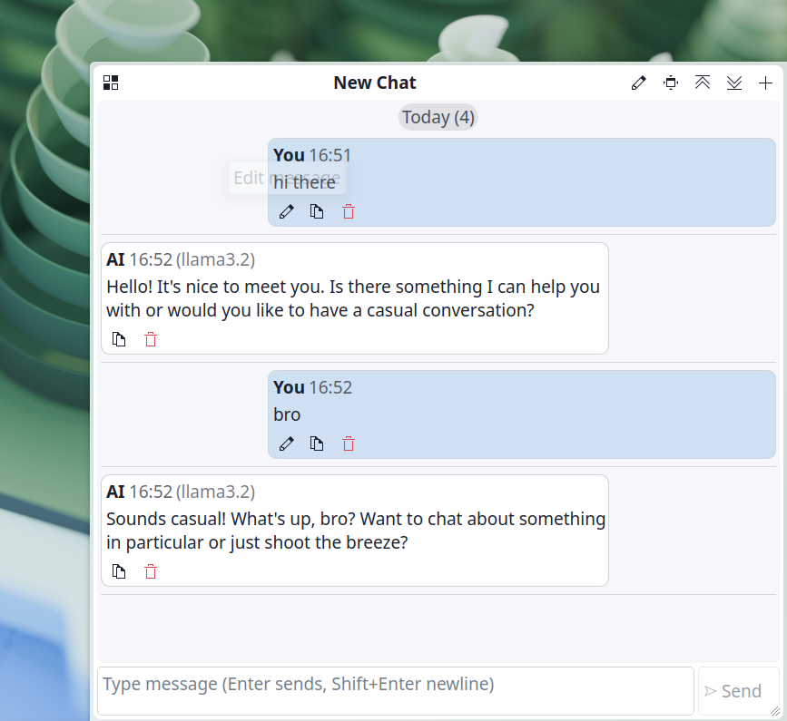
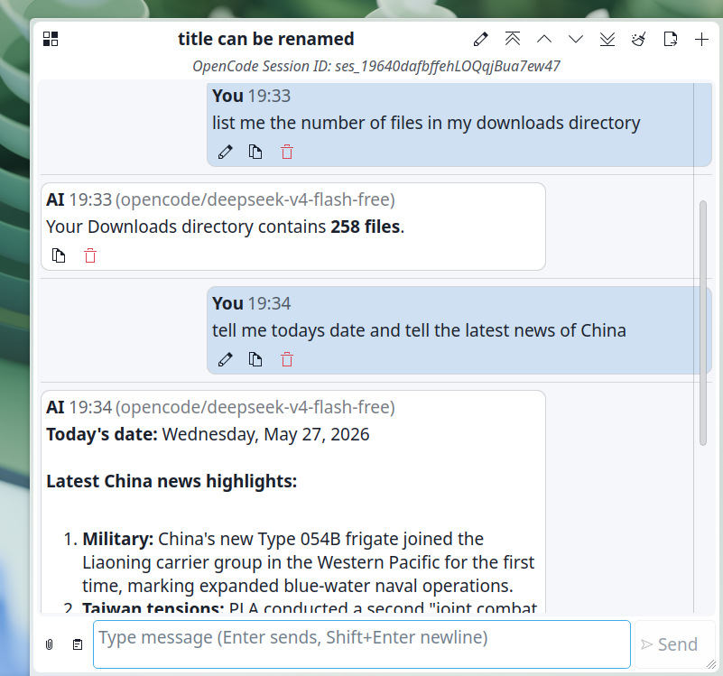
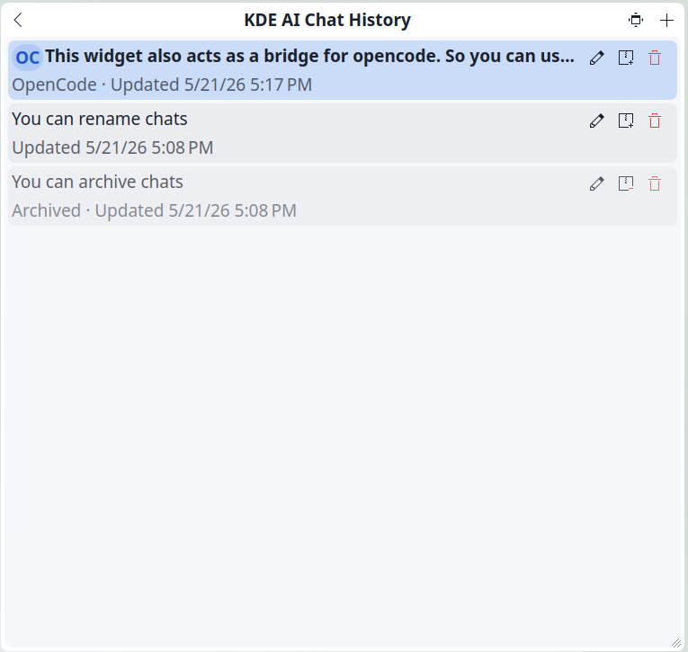
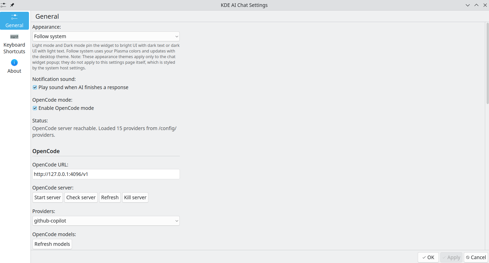
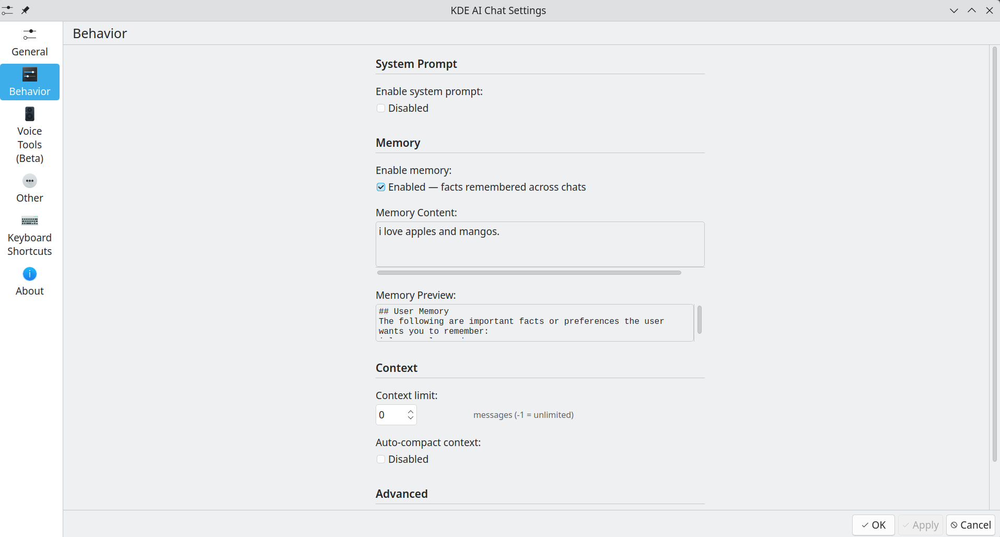

# KDE AI Chat — Native KDE Plasma 6 AI Chat Widget

[](https://store.kde.org/p/2360152/) [](https://github.com/racstan/KDE-AI-Chat/releases)

Native, highly responsive AI chat widget (plasmoid) for **KDE Plasma 6** and **Qt 6**. It features seamless multi-provider switching, real-time model discovery, session persistence, direct SSE streaming, and secure KWallet integration. Available to download on the [KDE Store](https://store.kde.org/p/2360152/).

---

### 📸 Showcase & Feature Walkthrough

| Screenshot | Feature & Explanation |
| :--- | :--- |
|  | **Providers & Models Dropdown**: Use any provider from our extensive list with your custom API keys, or run offline local models through local engines (Ollama, LM Studio). For persistent saving of API keys, utilize the secure native **KWallet** storage backend; alternatively, easily input or clear API keys directly as you wish! |
|  | **OpenCode Bridge**: Build an interactive execution bridge between the chat widget and your local OpenCode environment. Simply toggle the **OpenCode** selector to make it the default conversation mode. Start the local OpenCode server, click refresh, and select your preferred providers and model weights. |
|  | **Conversations Sidebar**: Efficiently manage all your active chats in the sidebar history panel. Supports renaming, archiving, and deleting threads in a click. OpenCode developmental chats are visually styled differently so you can tell them apart at a glance! |
|  | **Widget Settings Panel**: Custom tuning, custom system prompt templates, theme overrides (Dark/Light follow system), audio chime notifications, and dynamic scaling controls. We highly recommend users look after this panel to tinker and play with each custom option! |
|  | **About KDE AI Chat**: Showcases licensing, version metrics, and project credits. We are fully open to contributions and community feedback to expand Plasmoid AI integrations! |


---

## Key Features

- **Multi-Provider Switching**: Native integration with OpenAI, Anthropic (Claude), Groq, DeepSeek, Google Gemini, OpenRouter, Mistral, Cloudflare Workers AI, NVIDIA, Hugging Face, xAI (Grok), Ollama, LM Studio, and local OpenAI-compatible endpoints.
- **Offline & Local AI Priority**: Keyless out-of-the-box integration with offline local LLM engines (Ollama, LM Studio, or custom local OpenAI-compatible endpoints), allowing complete data privacy and local-only operations.
- **Dynamic Model Discovery**: Auto-detects and populates model lists directly from API endpoints, featuring a real-time searchable combobox.
- **Local Priority (OpenCode Mode)**: Special developer-priority mode with server process control (Start/Stop/Kill controls directly from settings).
- **Session History Manager**: Persistence layer supporting creating, renaming, archiving, and deleting chat threads, categorized with elegant date groupings.
- **Premium UX**: Markdown parsing, multi-line auto-resizing text fields, and smooth keyboard shortcuts (Ctrl+Enter to send, arrow keys to navigate history).
- **Secure KWallet Storage**: Secure DBus credential loading to prevent exposing raw API keys in plain text.
- **Popup Canvas Scaling**: Custom bottom-right drag-to-resize handle that persists coordinates natively via KConfigXT backend.
- **Theme Compliant**: Perfectly adapts to Dark and Light modes, supporting custom pinning (Light/Dark/Follow system).

---

## Codebase Quality & Audit Status

As of **May 21, 2026**, the codebase has undergone a comprehensive structural audit and is marked **100% production-ready**:
- **Diagnostic Safety**: The codebase successfully compiles and passes QML structural analysis using the KDE diagnostic suite (`qmllint`) with **zero errors and zero warnings**.
- **Security Hardening**: Secure DBus transactions with DBus filters in `applyLoadedKey` to prevent status warnings from entering input fields.
- **Immaculate Directory**: All pre-production developer notes, scratchpads, and unused file assets (such as `steps.txt`, `PLASMA6_WIDGET_DOCS.md`, and the redundant `apiWorker.mjs` file) have been removed for clean packaging.

---

## Repository Structure

**KDE AI Chat** is 100% open-source. The repository is organized under a standard KDE Plasma KPackage layout, allowing developers to audit, run diagnostic linters, and build from source:

```text
KDE-AI-Chat/
├── org.kde.plasma.kdeaichat/       # Core Widget Package (KPackage structure)
│   ├── metadata.json             # Plasmoid manifest (version, licensing, API specs)
│   └── contents/
│       ├── config/
│       │   ├── config.qml        # Config UI page binder
│       │   └── main.xml          # KConfigXT schema for persistent storage
│       └── ui/
│           ├── ConfigGeneral.qml # Widget settings panel (sync logic & API keys)
│           └── main.qml          # Widget main interface (popup, database & SSE)
├── .gitignore                    # Git file tracking safety guard
├── install.sh                    # One-click developer clean-reinstall script
├── audit.md                      # Detailed technical audit report
├── SETUP.md                      # End-user credentials & provider setup guide
└── FORUSER.md                    # Release and publishing runbook
```

---

## Installation

You can install **KDE AI Chat** either directly through your desktop interface (recommended for general users) or build it directly from source (for developers and power users).

### Option 1: Native Desktop Installation (Recommended)
1. Right-click your desktop background or the Plasma panel and select **Add Widgets...**
2. Click **Get New Widgets** -> **Download New Plasma Widgets...**
3. In the search box, search for **"KDE AI Chat"** and click **Install**.

*This automatically fetches and registers the pre-compiled, verified release package from the KDE Store.*

### Option 2: Clone and Install from Source (For Developers)
If you want to run the latest development build or customize the source files:
1. Clone the open-source repository:
   ```bash
   git clone https://github.com/racstan/KDE-AI-Chat.git
   cd KDE-AI-Chat
   ```
2. Run the one-click local installation script:
   ```bash
   ./install.sh
   ```
3. Restart your Plasma shell to apply changes and register the widget:
   ```bash
   systemctl --user restart plasma-plasmashell.service
   ```
4. Right-click your desktop/panel, select **Add Widgets...**, search for **KDE AI Chat**, and drag it onto your screen!

---

## Technical Audit & Quality Control

Every package release is built following a rigorous QA checklist. The code is audited to verify:
- **Syntax Integrity**: Compiles with `qmllint` showing 0 warnings and 0 errors.
- **Security Protocols**: Safe DBus API key storage with input sanitization to protect user credentials.
- **Process Robustness**: Resizing coordinates persist natively across system sessions, and long-running API tasks execute strictly off-thread to ensure the Plasma desktop shell remains 100% fluid.

For detailed analysis, refer to the [Technical Audit Report](file:///home/home/Programming/rachitkdeaichat/audit.md).

---

## Build & Publishing Flow (For Developers)

For developers packaging the widget from local sources, standard procedures are detailed in the [Release Operator Playbook](file:///home/home/Programming/rachitkdeaichat/FORUSER.md). Building the distribution archive requires zipping the QML package structure:

```bash
# Compress the QML folder into a Plasma-compliant .plasmoid archive
zip -r "dist/org.kde.plasma.kdeaichat-v1.1.plasmoid" org.kde.plasma.kdeaichat \
  -x "*.git*" "*__pycache__*" "*.DS_Store"
```


## Changelog

For a detailed history of features, bug fixes, and performance updates across all releases, please refer to the dedicated [changelog.md](changelog.md) file.

---

## 🤝 Open to Contributions & Future Roadmap

**KDE AI Chat** is built by the community, for the community! We are highly open to contributions, bug reports, and collaborative feature enhancements to shape the best native Linux AI experience.

### 🚀 What We're Working On Next
We are planning multiple active development rounds to implement new requested features:
1. **Elegant UI Enhancements**: Redefining QML layouts with premium modern visual aesthetics, sleek micro-animations, glassmorphism card panels, and smooth scroll interfaces.
2. **Interactive Elements for OpenCode**: Introducing rich interactive layouts inside chat bubbles to render code previews, live shell triggers, and interactive compiler feedback widgets.

---

## Documentation Guides

- [User Operations Manual & FAQ](file:///home/home/Programming/rachitkdeaichat/user_manual.md) — Dynamic step-by-step operating workflows, local setups, and detailed troubleshooting solutions.
- [End-User Setup & API Keys Guide](file:///home/home/Programming/rachitkdeaichat/SETUP.md) — Comprehensive guide on creating accounts and retrieving keys for all 13 providers.
- [Technical Audit & Code Quality Report](file:///home/home/Programming/rachitkdeaichat/audit.md) — Detailed results of the May 2026 quality assurance audit.
- [Release Operator Playbook](file:///home/home/Programming/rachitkdeaichat/FORUSER.md) — Bumping versioning, tag management, and release steps.

---

## License

GPL-2.0+ — See `metadata.json` for licensing specs.
